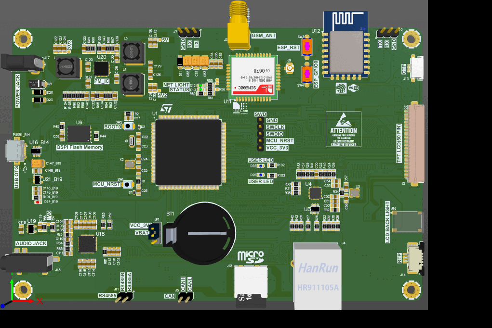

# HMI PCB

This Github repository contain final PCBdoc for HMI PCB Project.

## Demo

## Features

- The microcontroler of this board is STM32H743iit6(cortex m7)
- Support TFT LCD (50pin)
- Support capacitive touch panel(GT911)
- Support resistive touch panel(xpt2046)
- Support QSPI Flash memory
- Support SDRAM_SDR
- Support Ethernet 10/100
- Support micro SD card
- Support Audio codec
- Support USB OTG
- Support sim800c and ESP12E module
- Support RS485 and CAN